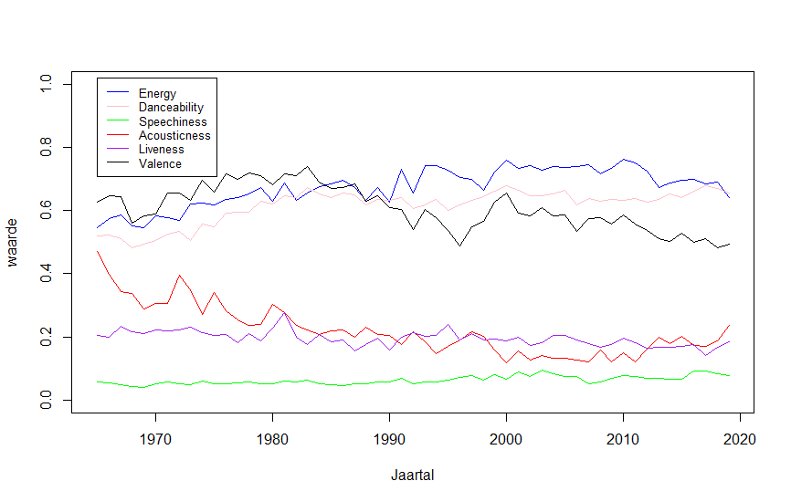

```{r setup, include=FALSE}
library(tidyverse)
library(plotly)
library(heatmaply)
library(protoclust)
library(spotifyr)
library(compmus)
source('spotify.R')
source('playlists.R')
```

### Chart A`r emo::ji("sunglasses")`

Hallo **wereld**, welkom op mijn *website*. `r emo::ji("sunglasses")` `r emo::ji("ok_hand")` `r emo::ji("100")`


_________

* Hallo
  * 1...
  * 2...
  * 3...
* **Wereld!!!!** `r emo::ji("fire")`

1. Welkom
   1. op
   1. mijn
1. *website*

***
> Ik wens u een *prettige* dag. `r emo::ji("revolving_hearts")`

### Chart B



___________
Deze tabel bevat belangrijke informatie

Hallo  | **wereld**
-------|------------
Welkom | op
mijn   | *website*


### Chart C

```{r}
Alle_koren_energy_plot <-
  Alle_koren %>%
  ggplot(aes(x = playlist, y = energy)) +
  geom_boxplot() +
  xlab("Koren") +
  ylab("Energy") +
  geom_hline(yintercept=mean(top_100_over_alle_jaren$energy, na.rm = TRUE), linetype="dashed")

Alle_koren_energy_plot
```

